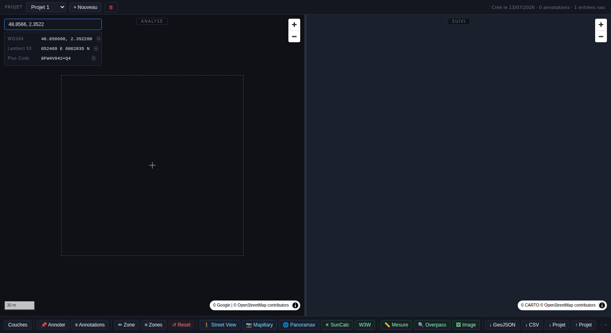
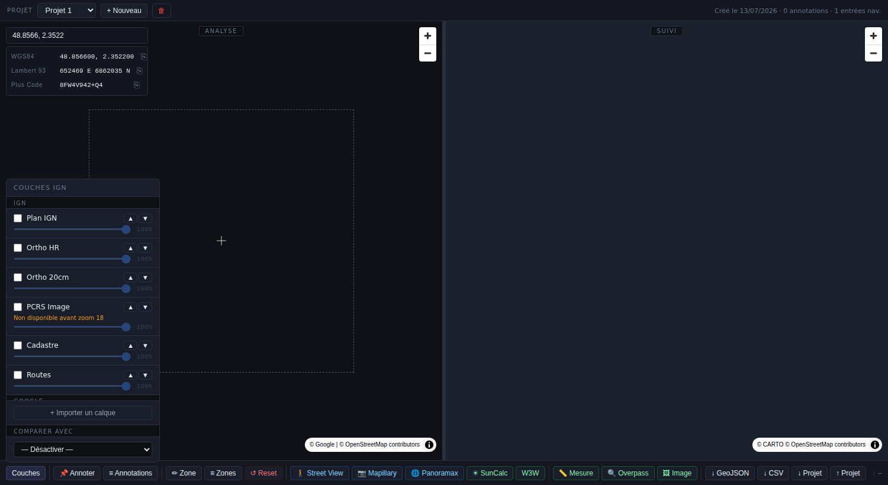
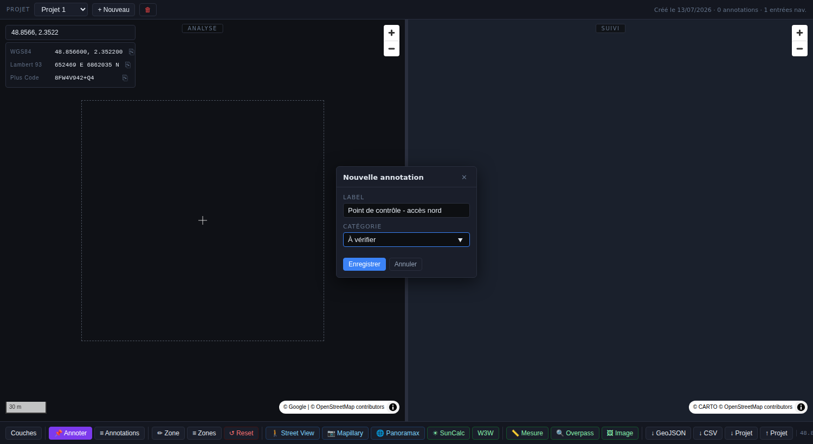
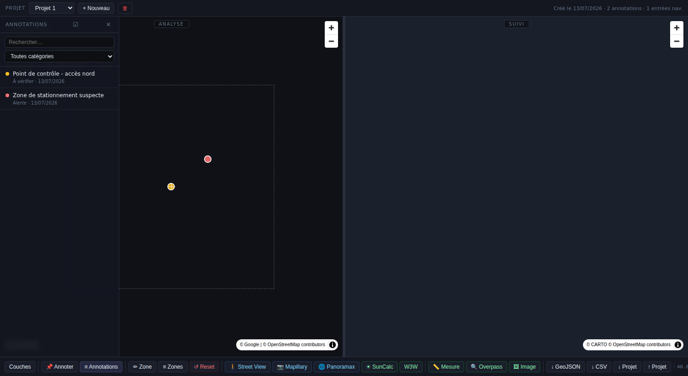
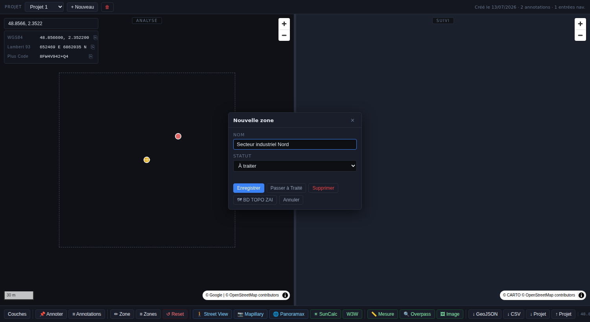
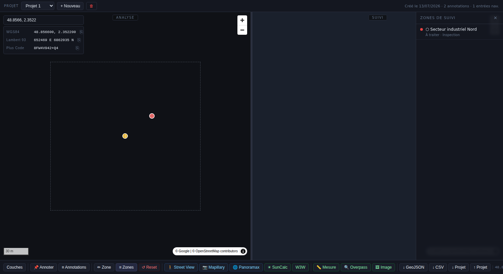
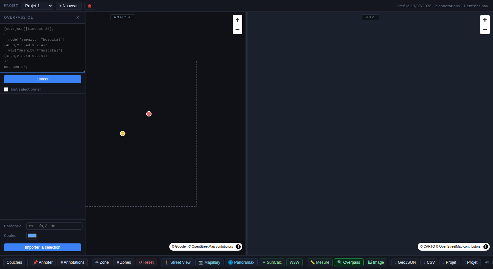
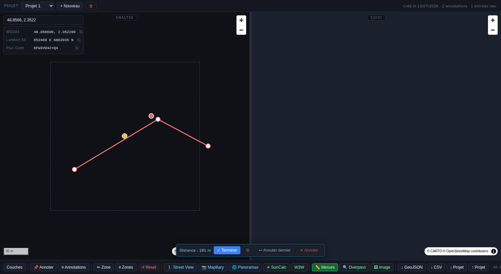
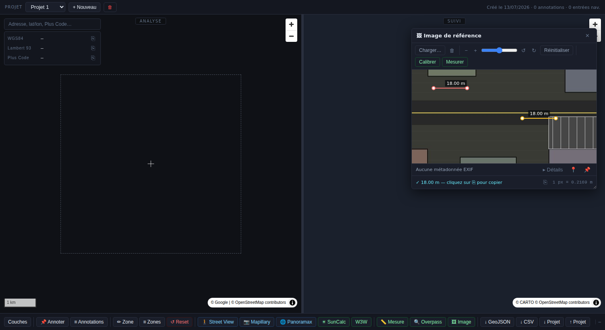

# GeoINT Explorer — Documentation et mode opératoire

Manuel de référence de l'application **GeoINT Explorer** : présentation, description de chaque module et procédures pas-à-pas pour l'utiliser au quotidien. Pour une fiche technique condensée (architecture, stack), voir [`README.md`](./README.md).

> Application 100 % statique, sans backend : tout est stocké dans le `localStorage` du navigateur. Aucune installation, aucun compte, aucune clé API.

---

## Table des matières

1. [Présentation](#1-présentation)
2. [Premier lancement et installation](#2-premier-lancement-et-installation)
3. [Vue d'ensemble de l'interface](#3-vue-densemble-de-linterface)
4. [Gérer ses projets](#4-gérer-ses-projets)
5. [Couches cartographiques](#5-couches-cartographiques)
6. [Recherche et navigation](#6-recherche-et-navigation)
7. [Coordonnées du centre de carte](#7-coordonnées-du-centre-de-carte)
8. [Annotations](#8-annotations)
9. [Journal de navigation (tracker)](#9-journal-de-navigation-tracker)
10. [Zones de suivi](#10-zones-de-suivi)
11. [Requêtes BD TOPO IGN / Overpass (OSM)](#11-requêtes-bd-topo-ign--overpass-osm)
12. [Mesure linéaire sur la carte](#12-mesure-linéaire-sur-la-carte)
13. [Image de référence](#13-image-de-référence)
14. [Vue terrain (Street View, Mapillary, Panoramax, SunCalc, W3W)](#14-vue-terrain)
15. [Export et import](#15-export-et-import)
16. [Raccourcis clavier](#16-raccourcis-clavier)
17. [Gestion du stockage et dépannage](#17-gestion-du-stockage-et-dépannage)
18. [Exemples de scénarios complets](#18-exemples-de-scénarios-complets)
19. [Foire aux questions](#19-foire-aux-questions)

---

## 1. Présentation

GeoINT Explorer est un **poste de travail d'analyse géographique (GEOINT)** destiné à un usage OSINT / renseignement d'origine géospatiale. Il répond à un problème précis : quand on analyse une zone pendant plusieurs séances de travail, **on perd le fil** — quelles rues a-t-on déjà survolées, quels bâtiments ont été vérifiés, quelle zone reste à traiter ?

L'application résout ce problème en combinant, projet par projet :

- une **carte d'analyse** pour naviguer et travailler (imagerie IGN haute résolution, Google Satellite) ;
- une **carte de suivi** qui mémorise automatiquement tout ce qui a été survolé, et sur laquelle on peut délimiter des zones à statut (à traiter / traité) ;
- des **annotations** géolocalisées (points d'intérêt, alertes, éléments à vérifier) ;
- des **outils d'analyse** : mesure de distance, image de référence pour estimer des tailles sur une photo terrain, requêtes OSM/BD TOPO pour importer des points d'intérêt en masse.

Tout est isolé par **projet** (une mission = un projet), exportable/importable en JSON pour être partagé ou archivé.

---

## 2. Premier lancement et installation

Aucune installation n'est nécessaire : l'application est un ensemble de fichiers HTML/CSS/JS statiques. Il faut simplement les servir via un serveur HTTP local (les imports de modules ES ne fonctionnent pas en ouvrant `index.html` directement avec `file://`).

```bash
# Option 1 — Python (déjà présent sur la plupart des systèmes)
python3 -m http.server 8080

# Option 2 — Node, sans installation globale
npx serve .
```

Puis ouvrir `http://localhost:8080` dans un navigateur récent (Chrome, Firefox, Edge).

Au tout premier lancement, l'application crée automatiquement un projet nommé **« Projet 1 »** et vous y place directement.

---

## 3. Vue d'ensemble de l'interface



L'écran est structuré en trois zones fixes :

| Zone | Rôle |
|---|---|
| **Barre de projet** (haut) | Sélection / création / suppression du projet actif |
| **Deux cartes côte à côte** | À gauche : carte d'**analyse** (travail en cours). À droite : carte de **suivi** (avancement global) |
| **Barre de contrôle** (bas) | Tous les outils : couches, annotations, zones, mesure, export, vue terrain… |

Points clés :

- La carte de suivi reste **toujours centrée** sur la carte d'analyse — inutile de la recentrer manuellement.
- Le **séparateur vertical** entre les deux cartes se fait glisser à la souris pour redimensionner les volets ; un double-clic dessus rétablit le 50/50.
- Un **rectangle en pointillés** est visible en permanence au centre de la carte d'analyse : c'est la zone exacte qui sera enregistrée dans l'historique de navigation à chaque déplacement (voir [§9](#9-journal-de-navigation-tracker)).
- En haut à gauche : le champ de recherche et l'affichage permanent des coordonnées du centre de carte (WGS84, Lambert 93, Plus Code).
- Sous les 900px de largeur, la disposition bascule automatiquement en mode vertical (carte d'analyse au-dessus, carte de suivi en dessous).

---

## 4. Gérer ses projets

Un **projet** regroupe toutes les données d'une mission d'analyse : annotations, historique de navigation, zones de suivi, calques importés, image de référence, configuration des couches. Changer de projet recharge intégralement les deux cartes avec les données du projet sélectionné — les projets sont totalement isolés les uns des autres.

| Action | Comment faire |
|---|---|
| Créer un projet | Bouton **+ Nouveau** dans la barre du haut |
| Changer de projet actif | Menu déroulant à côté de « PROJET » |
| Supprimer le projet actif | Bouton 🗑 (une confirmation est demandée — action irréversible) |
| Exporter le projet actif | Bouton **↓ Projet** dans la barre de contrôle (voir [§15](#15-export-et-import)) |
| Importer un projet | Bouton **↑ Projet** — choix entre créer un nouveau projet ou fusionner dans un projet existant |

> **Bon réflexe** : un projet par mission ou par zone géographique d'intérêt distincte. Cela garde l'historique de navigation et les zones de suivi pertinents, sans mélanger des contextes différents.

---

## 5. Couches cartographiques



Le bouton **Couches** ouvre le panneau de sélection des fonds de carte, superposables avec réglage d'opacité individuel et ordre de superposition (flèches ▲▼).

### Couches IGN Géoplateforme

| Couche | Zoom utile | Remarque |
|---|---|---|
| Plan IGN | 6 – 18 | Carte vectorisée classique |
| Ortho HR | 6 – 21 | Orthophoto haute résolution |
| Ortho 20cm | 16 – 21 | Résolution 20 cm/pixel — nécessite un zoom élevé |
| PCRS Image | 18 – 21 | Plan Corps de Rue Simplifié, très haute précision urbaine |
| Cadastre | 13 – 20 | Parcelles cadastrales |
| Routes | 6 – 18 | Réseau routier |

Si une couche à seuil de zoom élevé (PCRS, Ortho 20cm) est cochée mais que le zoom actuel est insuffisant, un avertissement **« Non disponible à ce niveau de zoom »** s'affiche à la place de tuiles vides.

### Couches Google

Google Satellite (activée par défaut), Google Hybride (satellite + noms de rues), Google Maps (routier).

### Calques externes (GeoJSON / KML)

En bas du panneau, **+ Importer un calque** permet de charger un fichier `.geojson`, `.json` ou `.kml` local et de le superposer sur la carte d'analyse. Le calque est fusionné dans le projet actif (pas de nouveau projet créé) ; chaque calque importé a sa propre pastille de couleur, une case à cocher de visibilité, et un bouton de suppression.

### Mode comparaison

En bas du panneau, un sélecteur **Comparer avec** permet d'afficher un second fond de carte en mode côte-à-côte (« swipe ») sur la carte d'analyse, utile pour comparer deux millésimes d'orthophoto ou deux sources.

---

## 6. Recherche et navigation

Le champ de recherche, en overlay haut-gauche de la carte d'analyse, accepte trois formats sans qu'il soit nécessaire de préciser lequel :

| Format | Exemple | Traitement |
|---|---|---|
| Adresse | `12 rue de Rivoli, Paris` | Autocomplétion via l'API Adresse (data.gouv.fr), debounce 300 ms |
| Coordonnées WGS84 | `48.8566, 2.3522` ou `48.8566 2.3522` | Détecté localement, sans appel réseau |
| Plus Code (OLC) | `8FW4V83X+8Q` | Décodé localement (algorithme intégré, sans dépendance externe) |

Sélectionner un résultat (clic ou touche **Entrée** si un seul résultat) centre la carte d'analyse au **zoom 17**.

---

## 7. Coordonnées du centre de carte

Sous le champ de recherche, trois lignes affichent en permanence la position du **centre** de la carte d'analyse, mises à jour à chaque déplacement :

- **WGS84** — `lat, lon` à 6 décimales
- **Lambert 93** (EPSG:2154) — `X E  Y N`, arrondi au décimètre
- **Plus Code** — code OLC calculé localement

Chaque ligne a un bouton **⎘** qui copie la valeur dans le presse-papier (avec un ✓ de confirmation temporaire).

---

## 8. Annotations



Les annotations sont des points d'intérêt géolocalisés : élément à vérifier, alerte, information, zone traitée…

### Créer une annotation

1. Cliquer sur **📌 Annoter** dans la barre de contrôle — le bouton devient violet, le curseur passe en croix : le mode annotation est actif.
2. Cliquer à l'endroit voulu sur la carte d'analyse.
3. Dans la popup qui s'ouvre, saisir un **label** (texte libre) et une **catégorie** — `Info`, `Alerte`, `Traité`, `À vérifier` sont proposées, mais toute valeur libre est acceptée.
4. Cliquer **Enregistrer** (ou touche **Entrée**).
5. Le mode annotation reste actif tant qu'on ne le désactive pas (re-clic sur le bouton ou touche **Échap**) — pratique pour placer plusieurs points d'affilée.

### Consulter, modifier, supprimer

En mode inactif, cliquer sur un marqueur existant ouvre une popup de consultation avec label, catégorie, date de création, et les boutons **Modifier** / **Supprimer**.

### Panneau liste



Le bouton **≡ Annotations** ouvre le panneau liste : recherche textuelle sur le label, filtre par catégorie, et un mode sélection (icône ☑) pour supprimer plusieurs annotations d'un coup. Cliquer sur une entrée de la liste centre la carte d'analyse sur l'annotation correspondante (zoom 17).

---

## 9. Journal de navigation (tracker)

C'est le mécanisme central qui garantit de **ne jamais perdre le fil** d'une analyse. Aucune action manuelle n'est nécessaire : chaque déplacement pertinent sur la carte d'analyse est enregistré automatiquement.

### Fonctionnement

Le rectangle en pointillés visible en permanence au centre de la carte d'analyse matérialise la zone qui sera enregistrée — pas l'écran entier. Une entrée est ajoutée à l'historique **uniquement** si :

- le niveau de zoom est **≥ 14** (les vues très dézoomées n'apportent rien au suivi) ;
- **et** le rectangle ne chevauche pas à plus de 80 % la dernière entrée enregistrée (évite le spam lors d'un simple recentrage).

### Niveaux de couverture

| Niveau | Zoom | Couleur sur la carte de suivi | Signification |
|---|---|---|---|
| Survol | 14 – 16 | Jaune pâle | Zone aperçue, non analysée en détail |
| Inspection | 17 – 19 | Orange | Zone inspectée |
| Analyse détaillée | 20+ | Bleu vif | Zone traitée au niveau PCRS (résolution maximale) |

Sur la carte de suivi, chaque zone affiche la couleur de son **niveau le plus élevé atteint** — repasser sur une zone déjà analysée en détail avec un zoom plus faible ne fait jamais régresser la couleur.

- **Survol** d'un rectangle : infobulle `[date heure] zoom X — Niveau : …`
- **Clic** sur un rectangle : recentre la carte d'analyse sur cette position

### Réinitialisation

Le bouton **↺ Reset** vide l'historique de navigation **et** les visites terrain du projet actif (après confirmation). Les annotations et les zones de suivi manuelles ne sont **pas** touchées.

---

## 10. Zones de suivi

C'est l'outil de **pilotage d'avancement** : découper la zone d'intérêt en secteurs à statut, pour savoir en un coup d'œil ce qui reste à faire.

### Créer une zone

1. Sur la **carte de suivi** (volet droit), cliquer **✏ Zone**.
2. Cliquer successivement sur la carte pour poser les sommets du polygone. Une barre flottante en bas indique le nombre de points et propose **✓ Terminer**, **↩ Annuler dernier**, **✕ Annuler**.
3. Cliquer **✓ Terminer** : une popup s'ouvre.



4. Saisir un **nom** et choisir le **statut initial** (`À traiter` par défaut), puis **Enregistrer**.

### Statuts

| Statut | Couleur | Signification |
|---|---|---|
| À traiter | Rouge semi-transparent | Zone identifiée, pas encore analysée |
| Traité | Vert semi-transparent | Zone analysée |

Pour une zone **Traité**, l'application calcule et affiche automatiquement le **niveau de couverture maximal atteint** sur cette zone à partir du journal de navigation (ex. « Traité — Analyse détaillée (zoom 20) ») — cela permet de distinguer une zone traitée en simple survol d'une zone réellement inspectée au niveau PCRS.

### Gérer une zone existante

Cliquer sur une zone ouvre sa popup avec les actions **Passer à Traité**, **Supprimer**, et **🗺 BD TOPO ZAI** (voir §11) pour interroger automatiquement les données IGN dans l'emprise de la zone.

### Panneau liste



Le bouton **≡ Zones** liste toutes les zones du projet avec leur statut ; un clic centre la carte de suivi dessus.

Les contours des zones sont également visibles, avec un halo blanc pour la lisibilité, **sur la carte d'analyse**.

---

## 11. Requêtes BD TOPO IGN / Overpass (OSM)

Deux façons d'importer automatiquement des points d'intérêt en annotations, sans les saisir un par un.

### BD TOPO ZAI — depuis une zone de suivi

Depuis la popup d'une zone (§10), le bouton **🗺 BD TOPO ZAI** interroge la BD TOPO IGN (WFS) dans l'emprise de la zone : zones d'activité, équipements de transport, voirie structurante… Les résultats sont listés avec case à cocher ; on choisit une catégorie et une couleur d'annotation, puis **Importer la sélection**.

### Overpass QL — requête libre



Le bouton **🔍 Overpass** de la barre de contrôle ouvre un panneau de requête Overpass QL libre (syntaxe OpenStreetMap), sur la vue courante de la carte d'analyse :

1. Écrire ou coller une requête dans la zone de texte (exemple ci-dessous).
2. Cliquer **Lancer** — timeout de 45 s, 500 résultats maximum.
3. Cocher les résultats à importer, choisir catégorie + couleur.
4. **Importer la sélection** — chaque résultat devient une annotation.

```overpassql
[out:json][timeout:30];
(
  node["amenity"="hospital"](48.8,2.3,48.9,2.4);
  way["amenity"="hospital"](48.8,2.3,48.9,2.4);
);
out center;
```

> Aucun proxy n'est nécessaire : `overpass-api.de` a des en-têtes CORS ouverts.

---

## 12. Mesure linéaire sur la carte



Bouton **📏 Mesure** dans la barre de contrôle :

1. Cliquer pour poser un premier point, puis chaque point suivant du tracé.
2. **Double-clic** pour terminer le tracé.
3. La barre flottante en bas affiche la **distance totale** (haversine — mètres sous 1 km, kilomètres au-delà) et un bouton **⎘** pour la copier.
4. **Échap** ou re-clic sur le bouton **📏 Mesure** annule/réinitialise l'outil.

Pendant le tracé, une ligne de prévisualisation en pointillés jaunes suit le curseur avec la distance affichée en direct.

---

## 13. Image de référence



Cet outil sert à estimer des **distances ou tailles relatives sur une photo** (prise au sol, aérienne, capture d'écran…) qui n'est **pas géoréférencée** — typiquement une photo terrain ramenée d'un repérage. Il ouvre dans une **fenêtre flottante indépendante** de la carte : on peut continuer à naviguer sur la carte d'analyse pendant que la fenêtre est ouverte.

### Mode opératoire

1. Bouton **🖼 Image** → **Charger…** une image locale (JPEG/PNG).
2. Inspecter l'image : molette ou boutons **−/+** pour zoomer, slider ou boutons **↺/↻** pour pivoter.
3. **Calibrer** l'échelle :
   - cliquer **Calibrer** ;
   - cliquer 2 points de l'image dont la **distance réelle est connue** (ex. la largeur d'une place de parking, la longueur d'un véhicule visible) ;
   - saisir cette distance en mètres dans la boîte de dialogue qui apparaît.
4. **Mesurer** : cliquer **Mesurer**, poser des points sur l'image, **double-clic** pour terminer — la distance calculée à partir de l'échelle s'affiche en direct, puis reste inscrite sur le segment.

Chaque mesure reste dessinée sur l'image (elles s'accumulent, ce qui permet de comparer plusieurs distances sur une même photo) :

- **Clic direct sur un segment** (hors mode Calibrer/Mesurer) : le supprime. Supprimer le segment de calibration invalide la calibration (il faut recalibrer).
- **Réinitialiser** : efface tous les segments et remet la vue à zéro, **sans perdre la calibration active**.

### Persistance et fenêtre

La position et la taille de la fenêtre sont mémorisées (globalement, indépendamment du projet). L'image elle-même (compressée en JPEG, 1600 px max), la vue et la calibration sont sauvegardées **dans le projet actif** — elles survivent à un rechargement de page et suivent le projet lors d'un changement. Le bouton **🗑** supprime explicitement l'image de référence du projet.

### Métadonnées EXIF

Au chargement, un parseur EXIF interne (sans dépendance) extrait les métadonnées disponibles : appareil, date, paramètres de prise de vue, et **coordonnées GPS** si présentes.

- **📍** recentre la carte d'analyse sur la position GPS de la photo.
- **📌** crée directement une annotation à cette position (catégorie `Photo`, label = nom du fichier).

> Toutes les photos n'embarquent pas de GPS — messageries et réseaux sociaux suppriment souvent ce tag. L'absence de coordonnées GPS affichées n'indique donc pas une erreur de lecture.

---

## 14. Vue terrain

Boutons qui ouvrent, dans un **nouvel onglet**, un service externe centré sur la position actuelle de la carte d'analyse :

| Bouton | Service | Visite enregistrée sur la carte de suivi |
|---|---|---|
| 🚶 Street View | Google Maps | Point bleu |
| 📷 Mapillary | Mapillary | Point vert |
| 🌐 Panoramax | panoramax.ign.fr | Point orange |
| ☀ SunCalc | suncalc.org (position + date/heure courantes) | — |
| W3W | what3words.com | — |

Les visites terrain (Street View, Mapillary, Panoramax) sont conservées dans le projet et effacées par le bouton **↺ Reset** du journal de navigation.

---

## 15. Export et import

### Annotations seules

| Bouton | Format | Contenu |
|---|---|---|
| **↓ GeoJSON** | `.geojson` | `FeatureCollection` de points — `label`, `category`, `createdAt` |
| **↓ CSV** | `.csv` | `id, lat, lon, label, category, createdAt` |

### Projet complet

| Bouton | Action |
|---|---|
| **↓ Projet** | Exporte en JSON : annotations, zones, historique de navigation, visites terrain, calques importés, image de référence, configuration des couches, dernière vue |
| **↑ Projet** | Importe un fichier `.json` — au choix, crée un **nouveau projet**, ou **fusionne** dans un projet existant (les données sont concaténées sans écraser la configuration du projet cible) |

**Cas d'usage typique** : exporter un projet en fin de mission pour archivage, ou pour le transmettre à un collègue qui l'importera de son côté (fichier JSON autonome, aucune dépendance serveur).

---

## 16. Raccourcis clavier

| Touche | Effet |
|---|---|
| `Échap` | Quitte le mode annotation, le dessin de zone ou la mesure en cours ; ferme les popups |
| `Entrée` | Valide la popup active |

---

## 17. Gestion du stockage et dépannage

Toutes les données vivent dans le `localStorage` du navigateur (clés `geoint_project_{id}` et `geoint_index`), dont la capacité est limitée (généralement quelques Mo par domaine).

- **Bandeau d'avertissement** : si le quota approche sa limite, un bandeau non bloquant apparaît et les 20 entrées les plus anciennes du journal de navigation sont supprimées automatiquement (FIFO).
- **Quota dépassé malgré le nettoyage** : un message invite à **exporter ses données** (§15) puis à **supprimer un projet** pour libérer de l'espace.
- **Perte de données** : le `localStorage` est propre à un couple navigateur + domaine. Vider le cache du navigateur ou changer de machine efface les projets non exportés — exporter régulièrement les projets sensibles est recommandé.
- **Rien ne s'affiche sur la carte** : vérifier la connexion réseau — les tuiles IGN, Google et le géocodage nécessitent un accès Internet sortant (aucune clé API requise, mais les domaines `data.geopf.fr`, `api-adresse.data.gouv.fr`, `mt1.google.com`, `overpass-api.de` doivent être joignables).

---

## 18. Exemples de scénarios complets

### Exemple A — Cartographier une zone industrielle

1. Créer un projet dédié : **+ Nouveau** → nommer « Zone industrielle Nord ».
2. Rechercher l'adresse ou les coordonnées du secteur dans le champ de recherche (§6).
3. Activer la couche **Ortho 20cm** ou **PCRS Image** (zoom ≥ 18) pour l'inspection fine (§5).
4. Sur la carte de suivi, dessiner une **zone** englobant le secteur avec **✏ Zone**, la nommer et la laisser en statut `À traiter` (§10).
5. Depuis la popup de la zone, lancer **🗺 BD TOPO ZAI** pour importer automatiquement les équipements recensés par l'IGN (§11), ou une requête **Overpass** ciblée (ex. entrepôts, transformateurs).
6. Naviguer et zoomer dans la zone : le journal de navigation enregistre automatiquement la couverture (§9) — inutile de noter où on est passé.
7. Ajouter des **annotations** manuelles (📌) sur les points remarquables non couverts par l'import automatique.
8. Une fois l'inspection terminée, ouvrir la popup de la zone et cliquer **Passer à Traité** — le niveau de couverture atteint (Survol / Inspection / Analyse détaillée) s'affiche automatiquement.
9. **↓ Projet** pour archiver le résultat complet.

### Exemple B — Exploiter une photo terrain sans coordonnées

1. Ouvrir **🖼 Image** et charger la photo prise sur le terrain.
2. Si la photo contient des données GPS EXIF, cliquer **📍** pour centrer directement la carte d'analyse dessus, ou **📌** pour y déposer une annotation en un clic (§13).
3. Sinon, estimer une distance visible sur la photo (largeur d'une porte, d'un véhicule) : **Calibrer** en cliquant les deux points de référence et en saisissant la distance réelle.
4. Utiliser **Mesurer** pour évaluer d'autres distances sur la même photo (largeur d'un bâtiment, longueur d'une façade) — les segments s'accumulent et restent lisibles pour comparaison.

### Exemple C — Reprendre une analyse après plusieurs jours

1. Rouvrir l'application : le dernier projet actif et sa dernière vue sont restaurés automatiquement.
2. Ouvrir la **carte de suivi** : les rectangles colorés indiquent immédiatement ce qui a déjà été survolé (jaune), inspecté (orange) ou analysé en détail (bleu).
3. Ouvrir le panneau **≡ Zones** pour voir en un coup d'œil les secteurs encore `À traiter` (rouge) et ceux déjà `Traité` (vert).
4. Cliquer sur une zone `À traiter` pour y recentrer directement la carte d'analyse et reprendre le travail là où il avait été laissé.

---

## 19. Foire aux questions

**Faut-il une connexion Internet ?**
Oui, pour charger les fonds de carte (IGN, Google) et interroger les services de géocodage/OSM. Aucune clé API n'est nécessaire — tous les services utilisés ont des en-têtes CORS ouverts.

**Les données sont-elles envoyées à un serveur ?**
Non. Annotations, zones, historique de navigation et image de référence restent uniquement dans le `localStorage` du navigateur. Seuls les appels de géocodage, de tuiles cartographiques et de requêtes Overpass/BD TOPO transitent par le réseau (aucune donnée de projet n'y est envoyée).

**Comment transférer un projet vers un autre poste ?**
Exporter le projet (**↓ Projet**) puis l'importer sur l'autre poste (**↑ Projet**) — le fichier JSON généré est autonome.

**Que se passe-t-il si je supprime un projet par erreur ?**
La suppression est irréversible dès confirmation. Si le projet n'a pas été exporté au préalable, les données sont perdues — d'où l'intérêt d'exporter régulièrement les projets actifs importants.

**Le niveau de couverture d'une zone peut-il diminuer ?**
Non. Le niveau affiché est le **maximum historique** atteint sur cette zone d'après le journal de navigation ; il ne peut qu'augmenter.
